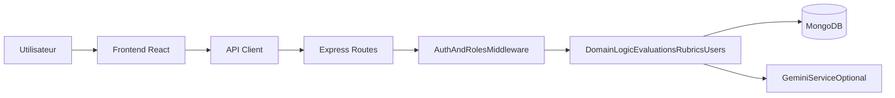

# Cartographie opérationnelle

Cette carte sert de guide rapide pour savoir où investiguer selon le type de question (auth, scoring, rôles, infra, tests).

## 1) Points d'entrée et fichiers pivots

### Démarrage global
- Backend entrypoint: [`backend/src/server.js`](../backend/src/server.js)
- Composition API Express: [`backend/src/app.js`](../backend/src/app.js)
- Frontend bootstrap: [`frontend/src/main.jsx`](../frontend/src/main.jsx)
- Routage frontend et garde d'accès: [`frontend/src/App.jsx`](../frontend/src/App.jsx)
- Orchestration des scripts projet: [`package.json`](../package.json)

### Configuration et runtime
- Dépendances/scripts backend: [`backend/package.json`](../backend/package.json)
- Dépendances/scripts frontend: [`frontend/package.json`](../frontend/package.json)
- Connexion MongoDB: [`backend/src/config/db.js`](../backend/src/config/db.js)
- Déploiement container: [`Dockerfile`](../Dockerfile), [`docker-compose.yml`](../docker-compose.yml)
- Variables d'environnement: [`backend/.env.example`](../backend/.env.example), [`frontend/.env.example`](../frontend/.env.example)

## 2) Carte des domaines fonctionnels

### Authentification et session
- API auth: [`backend/src/routes/auth.js`](../backend/src/routes/auth.js)
- Vérification JWT: [`backend/src/middleware/auth.js`](../backend/src/middleware/auth.js)
- Contrôle des rôles: [`backend/src/middleware/roles.js`](../backend/src/middleware/roles.js)
- Client API/token: [`frontend/src/lib/api.js`](../frontend/src/lib/api.js)
- Login/Register UI: [`frontend/src/pages/Login.jsx`](../frontend/src/pages/Login.jsx)

### Noyau métier évaluations et grilles
- Modèles: [`backend/src/models/Rubric.js`](../backend/src/models/Rubric.js), [`backend/src/models/Evaluation.js`](../backend/src/models/Evaluation.js), [`backend/src/models/Student.js`](../backend/src/models/Student.js)
- Routes: [`backend/src/routes/rubrics.js`](../backend/src/routes/rubrics.js), [`backend/src/routes/evaluations.js`](../backend/src/routes/evaluations.js), [`backend/src/routes/students.js`](../backend/src/routes/students.js)
- UI: [`frontend/src/pages/Evaluations.jsx`](../frontend/src/pages/Evaluations.jsx), [`frontend/src/pages/AdminRubric.jsx`](../frontend/src/pages/AdminRubric.jsx), [`frontend/src/pages/AdminStudents.jsx`](../frontend/src/pages/AdminStudents.jsx)
- Intégration externe: [`backend/src/services/gemini.js`](../backend/src/services/gemini.js)

### Administration des utilisateurs
- Modèle user: [`backend/src/models/User.js`](../backend/src/models/User.js)
- API admin users: [`backend/src/routes/users.js`](../backend/src/routes/users.js)
- UI admin users: [`frontend/src/pages/AdminUsers.jsx`](../frontend/src/pages/AdminUsers.jsx)

## 3) Parcours d'investigation rapide

- **Login ou redirection anormale**
  1. [`frontend/src/lib/api.js`](../frontend/src/lib/api.js)
  2. [`backend/src/middleware/auth.js`](../backend/src/middleware/auth.js)
  3. [`backend/src/routes/auth.js`](../backend/src/routes/auth.js)

- **Score incohérent ou calcul erroné**
  1. [`frontend/src/pages/Evaluations.jsx`](../frontend/src/pages/Evaluations.jsx)
  2. [`backend/src/routes/evaluations.js`](../backend/src/routes/evaluations.js)
  3. [`backend/src/models/Evaluation.js`](../backend/src/models/Evaluation.js)

- **Problème de permissions (admin/teacher)**
  1. [`frontend/src/App.jsx`](../frontend/src/App.jsx)
  2. [`backend/src/middleware/roles.js`](../backend/src/middleware/roles.js)
  3. Route API concernée dans [`backend/src/routes`](../backend/src/routes)

- **Impact build/deploy**
  1. [`Dockerfile`](../Dockerfile)
  2. [`docker-compose.yml`](../docker-compose.yml)
  3. [`backend/src/app.js`](../backend/src/app.js)

## 4) Zones à risque en priorité

- `frontend/src/pages/Evaluations.jsx`: forte complexité (état UI + calculs + PDF + historique).
- `frontend/src/lib/api.js`: effets transverses sur 401 (déconnexion/redirection globale).
- `backend/src/routes/evaluations.js`: logique métier critique + dépendance Gemini.
- `backend/src/server.js`: bootstrap sensible (création admin initial ; variables `ADMIN_INITIAL_*` dans `.env` / Docker).

## 5) Routine de validation après changement

### Commandes minimales
- `npm test` (racine)
- `npm --prefix frontend run lint`

### Vérifications manuelles minimales
- Auth: login/logout, accès route privée, comportement sans token.
- Rôles: accès admin vs teacher sur écrans d'administration.
- Évaluations: création/édition, cohérence score total, suppression.
- Grilles: CRUD, import/export JSON, réutilisation dans la page d'évaluation.

## 6) Snapshot de santé actuel

- `npm test`: OK (backend + frontend).
- `npm --prefix frontend run lint`: en échec avec problèmes existants non bloquants pour la cartographie.
- Fichiers qui concentrent les erreurs lint actuelles:
  - `frontend/src/pages/Evaluations.jsx`
  - `frontend/src/pages/AdminRubric.jsx`
  - `frontend/src/pages/AdminStudents.jsx`
  - `frontend/src/pages/AdminUsers.jsx`
  - `frontend/src/lib/api.js`
  - `frontend/src/lib/ThemeContext.jsx`
  - `frontend/src/pages/Login.jsx`

## 7) Vue d'ensemble des flux

